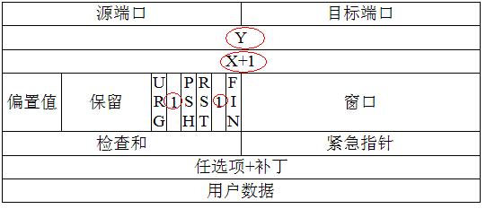

# 系统基础知识

### 进程和线程的区别

> 这个解答很多，暂时引自[进程和线程的区别介绍](https://baijiahao.baidu.com/s?id=1611925141861592999&wfr=spider&for=pc) 一文。

1、首先是定义

进程：是执行中一段程序，即一旦程序被载入到内存中并准备执行，它就是一个进程。进程是表示资源分配的的基本概念，又是调度运行的基本单位，是系统中的并发执行的单位。

线程：单个进程中执行中每个任务就是一个线程。线程是进程中执行运算的最小单位。

2、一个线程只能属于一个进程，但是一个进程可以拥有多个线程。多线程处理就是允许一个进程中在同一时刻执行多个任务。

3、线程是一种轻量级的进程，与进程相比，线程给操作系统带来侧创建、维护、和管理的负担要轻，意味着线程的代价或开销比较小。

4、线程没有地址空间，线程包含在进程的地址空间中。线程上下文只包含一个堆栈、一个寄存器、一个优先权，线程文本包含在他的进程 的文本片段中，进程拥有的所有资源都属于线程。所有的线程共享进程的内存和资源。 同一进程中的多个线程共享代码段(代码和常量)，数据段(全局变量和静态变量)，扩展段(堆存储)。但是每个线程拥有自己的栈段， 寄存器的内容，栈段又叫运行时段，用来存放所有局部变量和临时变量。

5、父和子进程使用进程间通信机制，同一进程的线程通过读取和写入数据到进程变量来通信。

6、进程内的任何线程都被看做是同位体，且处于相同的级别。不管是哪个线程创建了哪一个线程，进程内的任何线程都可以销毁、挂起、恢复和更改其它线程的优先权。线程也要对进程施加控制，进程中任何线程都可以通过销毁主线程来销毁进程，销毁主线程将导致该进程的销毁，对主线程的修改可能影响所有的线程。

7、子进程不对任何其他子进程施加控制，进程的线程可以对同一进程的其它线程施加控制。子进程不能对父进程施加控制，进程中所有线程都可以对主线程施加控制。

相同点：

进程和线程都有ID/寄存器组、状态和优先权、信息块，创建后都可更改自己的属性，都可与父进程共享资源、都不鞥直接访问其他无关进程或线程的资源。

### `HTTPS`的握手过程

密钥协商过程：

1. 客户端将TLS版本，支持的加密算法，ClientHello random C 发给服务端【客户端->服务端】
2. 服务端从加密算法中pick一个加密算法， ServerHello random  S，server 证书返回给客户端；【服务端->客户单】
3. 客户端验证 server 证书【客户端】
4. 客户端生成一个 48 字节的预备主密钥，其中前2个字节是 Protocol Version，后46个字节是随机数，客户端用证书中的公钥对预备主密钥进行非对称加密后通过 client key exchange 子消息发给服务端【客户端->服务端】
5. 服务端用私钥解密得到预备主密钥；【服务端】
6. 服务端和客户端都可以通过预备主密钥、ClientHello random C 和  ServerHello random S 通过 PRF 函数生成主密钥；会话密钥由主密钥、SecurityParameters.server_random 和 SecurityParameters.client_random 数通过 PRF 函数来生成会话密钥里面包含对称加密密钥、消息认证和 CBC 模式的初始化向量，对于非 CBC 模式的加密算法来说，就没有用到这个初始化向量。

> Session ID 缓存和 Session Ticket 里面保存的也是主密钥，而不是会话密钥，这样每次会话复用的时候再用双方的随机数和主密钥导出会话密钥，从而实现每次加密通信的会话密钥不一样，即使一个会话的主密钥泄露了或者被破解了也不会影响到另一个会话。

### 什么是`中间人攻击`？怎么预防

HTTP 明文传输，客户端和服务端进行通信时，中间人即指夹在客户端和服务端之间的第三者，对于客户端来说，中间人就是 **服务端**，对于服务端来说，中间人就是 **客户端**。中间人拦截客户端消息，然后再发送给服务端；服务端发发送消息给中间人，中间人再返还给客户端。

使用 HTTPS，单双向认证，

### `TCP`的握手过程？为什么进行三次握手，四次挥手

三次握手：

> 为了确认服务端和客户端双方的收发能力。

* 客户端发送 SYN = 1，seq=x 给服务端
* 服务端接收发送 SYN = 1，ACK = 1，ack=x+1， seq = y 给客户端
* 客户端发送 ACK = 1，ack = y+1 ，seq = z 给服务端

四次挥手：

* 主动方发送 FIN = 1，seq = u 给被动方；
* 被动方 ACK = 1，ack = u+1，seq = v；
* 被动方继续传输数据给主动方；
* 被动方没有更多数据了，发送 FIN = 1，ACK=1，seq = w，ack=u+1；
* 主动方 ACK = 1，seq = u + 1，ack = w +1;

### `堆和栈`区的区别？谁的占用内存空间大

> 解答出自：[堆区（heap）和栈区（stack）的区别](https://blog.csdn.net/shanshanhi/article/details/50904706)

（1）申请方式

栈区：由编译器自动分配释放，存放函数的参数值，局部变量值等；

堆区：一般由程序员分配释放（使用new/delete或malloc/free），若程序员不释放，程序结束时可能由OS回收；

（2）操作方式

栈区：操作方式类似于数据结构中的栈；

堆区：不同于数据结构中的堆，分配方式类似于链表。

（3）申请后系统的响应 

栈区：只要栈的剩余空间大于所申请空间，系统将为程序提供内存，否则将报异常提示栈溢出；

堆区：首先应该知道操作系统有一个记录空闲内存地址的链表，当系统收到程序的申请时，会遍历该链表，寻找第一个空间大于所申请空间的堆结点，然后将该结点从空闲结点链表中删除，并将该结点的空间分配给程序，另外，对于大多数系统，会在这块内存空间中的首地址处记录本次分配的大小，这样，代码中的delete语句才能正确的释放本内存空间。另外，由于找到的堆结点的大小不一定正好等于申请的大小，系统会自动的将多余的那部分重新放入空闲链表中。 

（4）申请大小的限制

栈区：在Windows下,栈是向低地址扩展的数据结构，是一块连续的内存的区域。这句话的意思是栈顶的地址和栈的最大容量是系统预先规定好的，在WINDOWS下，栈的大小是2M（也有的说是1M，总之是一个编译时就确定的常数），如果申请的空间超过栈的剩余空间时，将提示overflow。因此，能从栈获得的空间较小。

堆区：堆是向高地址扩展的数据结构，是不连续的内存区域。这是由于系统是用链表来存储的空闲内存地址的，自然是不连续的，而链表的遍历方向是由低地址向高地址。堆的大小受限于计算机系统中有效的虚拟内存。由此可见，堆获得的空间比较灵活，也比较大。 

（5）申请效率的比较

栈区：系统自动分配，速度较快。但程序员是无法控制的。

堆区：由new分配的内存，一般速度比较慢，而且容易产生内存碎片,不过用起来最方便. 

注意：在WINDOWS下，最好的方式是用VirtualAlloc分配内存，他不是在堆，也不是在栈是直接在进程的地址空间中保留一快内存，虽然用起来最不方便。但是速度快，也最灵活。

（6）堆和栈中的存储内容

栈区：在函数调用时，第一个进栈的是主函数中后的下一条指令（函数调用语句的下一条可执行语句）的地址，然后是函数的各个参数，在大多数的C编译器中，参数是由右往左入栈的，然后是函数中的局部变量。注意静态变量是不入栈的。当本次函数调用结束后，局部变量先出栈，然后是参数，最后栈顶指针指向最开始存的地址，也就是主函数中的下一条指令，程序由该点继续运行。

堆区：一般是在堆的头部用一个字节存放堆的大小。堆中的具体内容有程序员安排。

### 加密算法：`对称加密算法和非对称加密算法`区别

### 常见的`对称加密和非对称加密`算法有哪些

#### 对称加密

对称加密指的就是加密和解密使用同一个秘钥，所以叫做对称加密。对称加密只有一个秘钥，作为私钥。

具体算法有：DES，3DES，TDEA，Blowfish，RC5，IDEA。常见的有：DES，AES，3DES等等。

> 优点：算法公开、计算量小、加密速度快、加密效率高。 缺点：秘钥的管理和分发非常困难，不够安全。在数据传送前，发送方和接收方必须商定好秘钥，然后双方都必须要保存好秘钥，如果一方的秘钥被泄露，那么加密信息也就不安全了。另外，每对用户每次使用对称加密算法时，都需要使用其他人不知道的唯一秘钥，这会使得收、发双方所拥有的钥匙数量巨大，密钥管理成为双方的负担。

#### 非对称加密

非对称加密指的是：加密和解密使用不同的秘钥，一把作为公开的公钥，另一把作为私钥。公钥加密的信息，只有私钥才能解密。私钥加密的信息，只有公钥才能解密。 私钥只能由一方安全保管，不能外泄，而公钥则可以发给任何请求它的人。非对称加密使用这对密钥中的一个进行加密，而解密则需要另一个密钥。

我们常见的数字证书、加密狗即是采用非对称加密来完成安全验证的。

> 优点：安全性更高，公钥是公开的，秘钥是自己保存的，不需要将私钥给别人。 缺点：加密和解密花费时间长、速度慢，只适合对少量数据进行加密。

主要算法：RSA、Elgamal、背包算法、Rabin、HD,ECC（椭圆曲线加密算法）。常见的有：RSA，ECC

#### 银行动态令牌

网银比较流行的时候，银行给我们发一个动态令牌。这个令牌并不使用任何对称或者非对称加密的算法，在整个银行的认证体系中，动态令牌只是一个一次性口令的产生器，它是基于时间同步方式，每隔60秒产生一个随机6位动态密码在其中运行的主要计算仅包括时间因子的计算和散列值的计算。

在用户从银行手中拿到动态口令令牌卡的时候，在令牌卡的内部已经存储了一份种子文件（即图中钥匙所代表的seed），这份种子文件在银行的服务器里保存的完全一样的一份，所以对于动态口令令牌来说，这种方式是share secret的。另外在令牌硬件上的设置中，假使有人打开了这个令牌卡，种子文件将会从令牌卡的内存上擦除（待考证）。 令牌卡中有了种子文件，并实现了TOTP算法，在预先设置的间隔时间里它就能不断产生不同的动态口令，并显示到屏幕上，而银行服务器上跟随时间做同样的计算，也会得到和令牌卡同样的口令，用作认证。 那么TOTP算法具体做了什么操作呢？在RFC6238中有详细的算法描述，这里也会做简单的叙述。

> TOTP是来自 HOTP [RFC4226] 的变形，从统筹上看，他们都是将数据文件进行散列计算，只是HOTP的因子是事件因子，TOTP将因子换成了时间因子，具体的TOTP计算公式(其中的HMAC-SHA-256也可能是 HMAC-SHA-512)： TOTP = Truncate(HMAC-SHA-256(K,T))

其中： K 为这里的种子文件内容； T 为计算出来的时间因子 公式中的 HMAC是密钥相关的哈希运算消息认证码(Hash-based Message Authentication Code)，HMAC运算利用哈希算法，以一个密钥和一个消息为输入，生成一个消息摘要作为输出。而公式中给出的哈希算法是 SHA-256，这种哈希算法目前并没有好的破解办法。 令牌卡中预先设置了要显示的口令长度，TOTP 中的 Truncate 操作剪切获得口令。 以上就是动态口令令牌卡的内部原理。

> 解答出自 [对称加密算法与非对称加密算法的优缺点](https://zhuanlan.zhihu.com/p/38307899)

### `MD5、Sha1、Sha256`区别

签名算法，SHA(Security Hash Algorithm) ，貌似 MD5 更高效，花费时间更少，但相对较容易**碰撞**。SHA1 已经被攻破，所以安全性不行。

### `charles`抓包过程？不使用`charles`，`4G`网络如何抓包

 中间人攻击原理，easy。